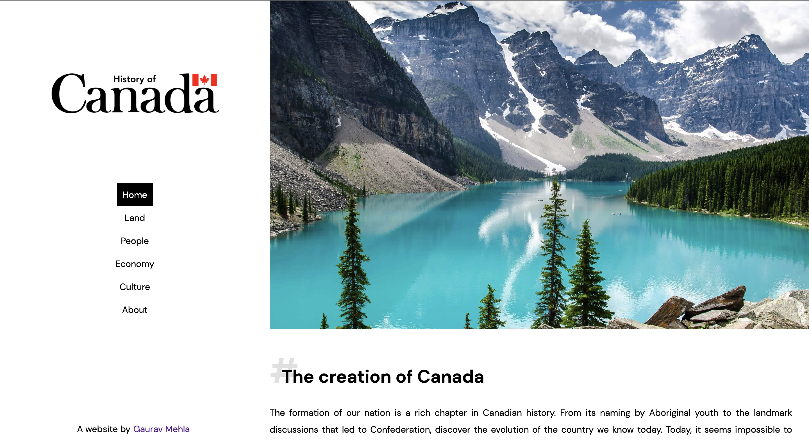
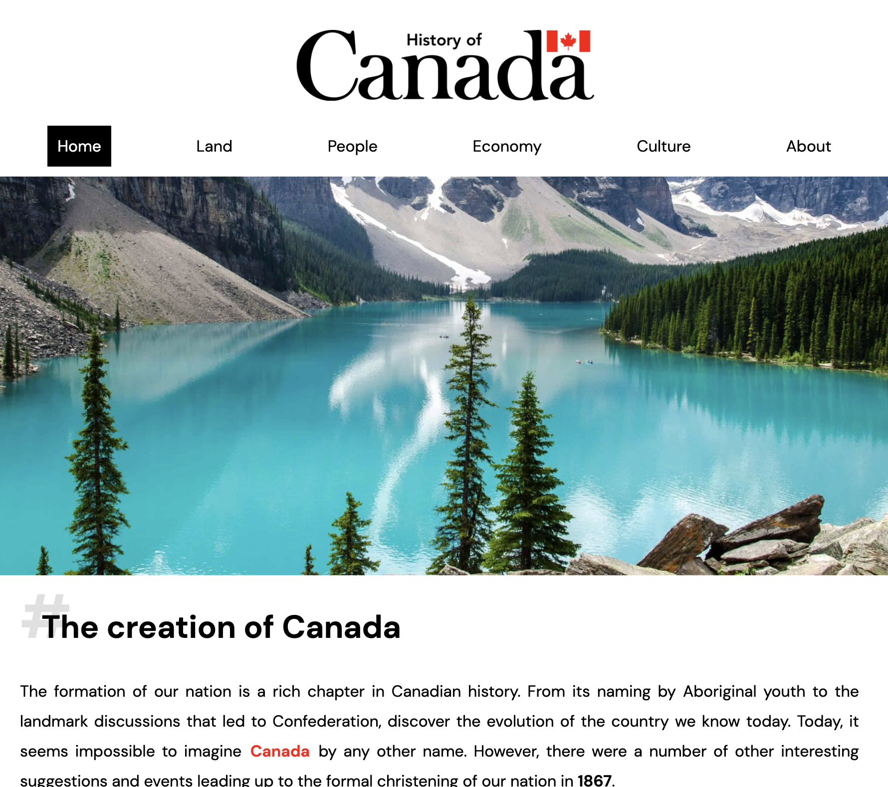
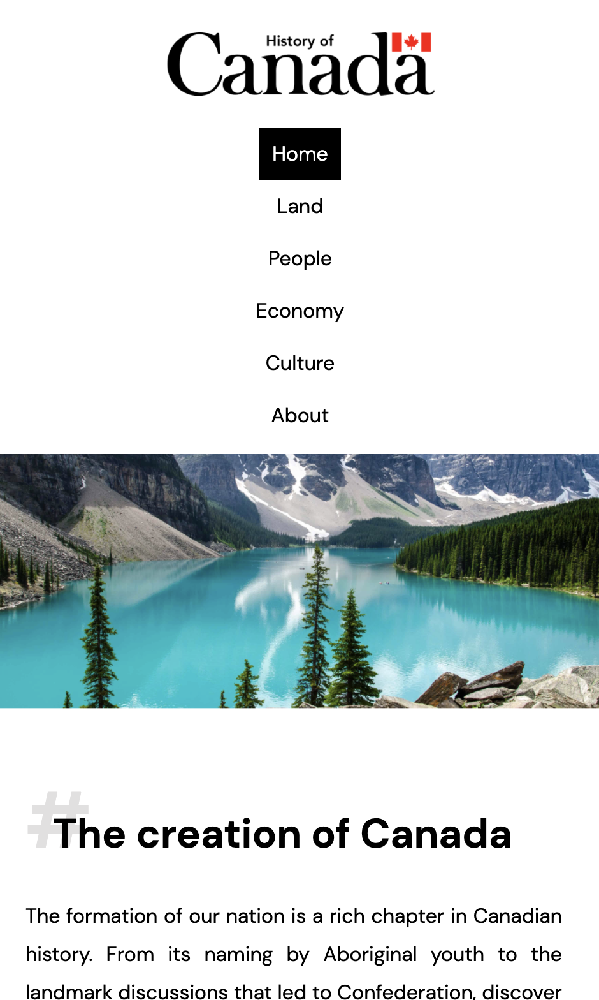

# History of Canada
Final project on topic "History of Canada" using basic HTML, CSS and JavaScript. 

Live: [mehla.in/canada-history](https://mehla.in/canada-history/)

## How to run this website?
There are two ways to check this website. 
1. [Live Server VS Code Extension](https://marketplace.visualstudio.com/items?itemName=ritwickdey.LiveServer)
2. [mehla.in/canada-history](https://mehla.in/canada-history)

## Technologies used
- Basic HTML
- Basic CSS
- Basic JS

## Desktop View

## iPad View

## Mobile View

## References
Content from 
1. [Canada - Wikipedia](https://en.wikipedia.org/wiki/Canada)
2. [Canada.ca](https://www.canada.ca/en/)

Images from
1. [Wallpapercave.com](https://wallpapercave.com/)
